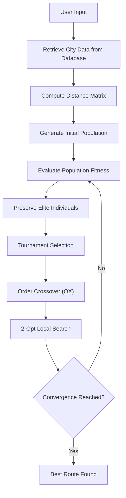

# 🌍 TSP for Worldwide Cities

A Python application that uses a Genetic Algorithm to approximate the shortest route between multiple cities worldwide.

Built with Python, Streamlit, SQLite, and GeoNames.

# Overview

This project solves the classic Travelling Salesman Problem (TSP) using a Genetic Algorithm (GA) in Python. Users pick any cities worldwide through a simple web interface, and the app computes the shortest possible round-trip route connecting them — using real latitude/longitude data and the haversine formula for accurate great-circle distances.

# 🛠️ Tech Stack

| Layer      | Technology                |
| ---------- | ------------------------- |
| Interface  | Streamlit                 |
| Algorithm  | Python                    |
| Storage    | SQLite                    |
| GeoNames   | Geographic dataset        |
| Data Source| GeoNames                  |

# Algorithm
The following is an approximation simplified to what the algorithm looks like. 

# Sreenshots

