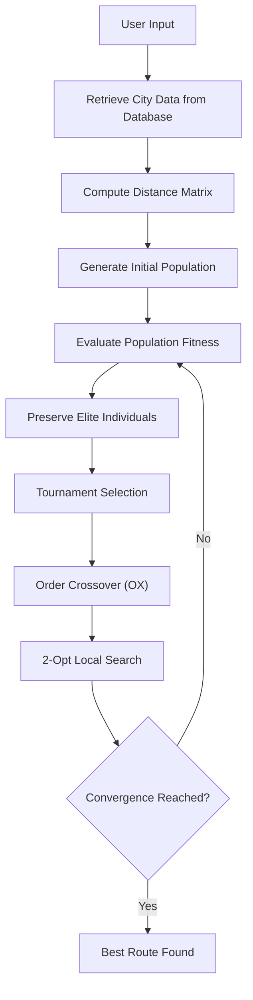
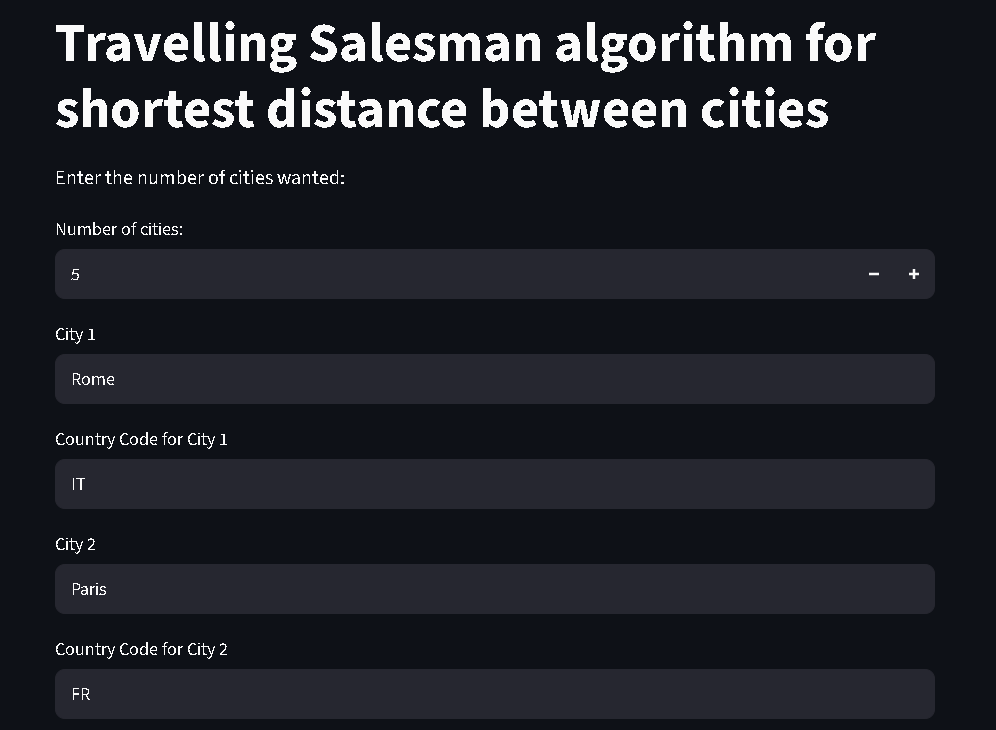
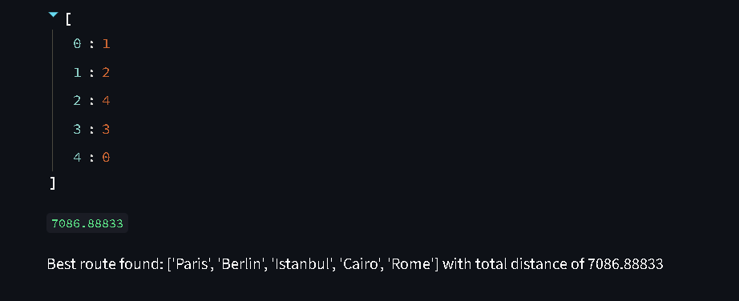

# 🌍 TSP for Worldwide Cities

A Python application that uses a Genetic Algorithm to approximate the shortest route between multiple cities worldwide.

Built with Python, Streamlit, SQLite, and GeoNames.

# Overview

This project solves the classic Travelling Salesman Problem (TSP) using a Genetic Algorithm (GA) in Python. Users pick any cities worldwide through a simple web interface, and the app computes the shortest possible round-trip route connecting them — using real latitude/longitude data and the haversine formula for accurate great-circle distances.

# 🛠️ Tech Stack

| Layer      | Technology                |
| ---------- | ------------------------- |
| Interface  | Streamlit                 |
| Algorithm  | Python                    |
| Storage    | SQLite                    |
| GeoNames   | Geographic dataset        |
| Data Source| GeoNames                  |

# Algorithm
The following is an approximation simplified to what the algorithm looks like. 

# Sreenshots

# Installation

To make the project easy to explore, a live demo has been deployed on Streamlit with a smaller database which consists of the cities that have over 5000 population wise world wide. You can test the application directly in your browser by entering a list of cities and observing the route generated by the Genetic Algorithm.

https://tspforworldwidecities-jhmrdsyucr3dd6pgy3dtzm.streamlit.app/

# Analysis

Once the user enters the desired number of cities, the program passes to the backend where the TSP algorithm is implemented. Within it, a population of possible chromosomes (solutions) is initialized then goes through fitness evaluation (total route distance) for elite performers to be preserved. Next, torunament selction is applied for random parents to be chosen for order cross-over (OPX) that produces a child and checks for inversion mutation possibility. 2-opt technique is then applied for population optimization purpose. Convergence checking comes after to balance the population and to increase the mutation rate if needed. The distance matrix required for the algorithm was calculated using the haversine formula that retrieves latitude and longitude values from the database implemented using SQLite. The coordinates set at allcountries.txt that was being downloaded from GeoCountires website. As the user specifies the set of cities alongside with their country code, the program computes the shortest path according to the genetic algorithma and outputs it to the interface.

NOTE: The full database could be locally deployed after downloading the allcountries.txt file that includes worldwide cities coordinates.

# Future improvements 

- Interactive map visualization
